# 論文模擬採点サービス — デモ説明資料

> 公務員試験の論文対策に特化した、AI自動採点Webアプリケーション

---

## このサービスでできること

受験者が**論文を書いて提出すると、AIが数秒〜十数秒で7つの観点からフィードバックを返します。**

管理者は試験問題と評価基準を自由に設計でき、受験者は何度でも同じ問題に挑戦できます。

---

## 目次

1. [受験者の体験フロー](#1-受験者の体験フロー)
2. [管理者の運用フロー](#2-管理者の運用フロー)
3. [AI採点の精度検証](#3-ai採点の精度検証)
4. [プロンプト設計の経緯と最終形](#4-プロンプト設計の経緯と最終形)
5. [運用コスト](#5-運用コスト)
6. [技術構成](#6-技術構成)
7. [データベース設計](#7-データベース設計)
8. [セキュリティ・認証](#8-セキュリティ認証)
9. [今後の開発計画](#9-今後の開発計画)

---

## 1. 受験者の体験フロー

### 1-1. ログイン → 問題選択

メールアドレスとパスワードでログインし、問題一覧から受けたい試験を選びます。

<details>
<summary>スクリーンショット: ログイン画面</summary>

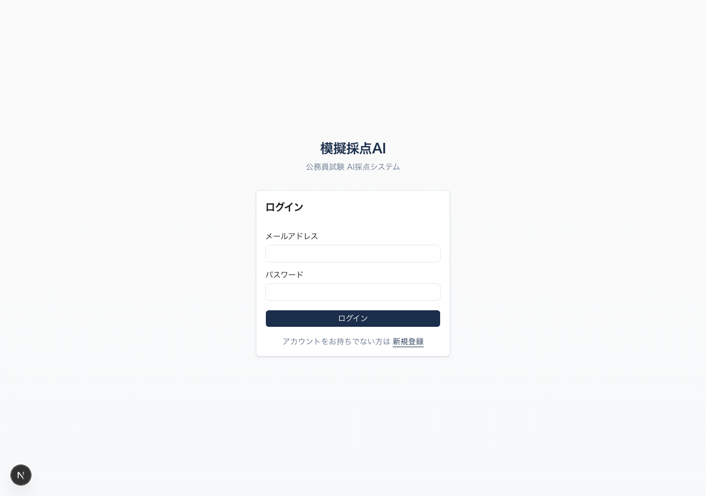

</details>

<details>
<summary>スクリーンショット: 問題一覧</summary>

各カードにタイトル・標準字数・出題文のプレビューが表示されます。

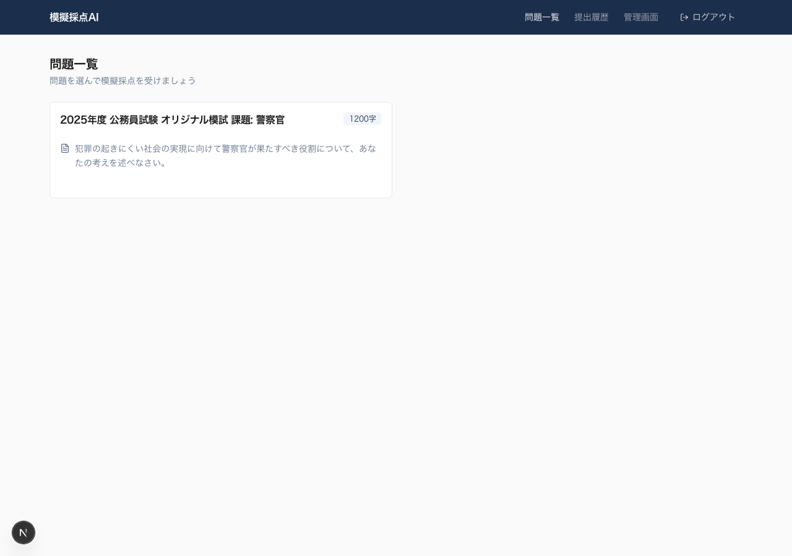

</details>

### 1-2. 原稿用紙風エディタで執筆

問題を選ぶと、**20列のグリッドレイアウト**で実際の原稿用紙に近い環境で論文を執筆できます。

- クリック・矢印キーでカーソル移動
- リアルタイム文字数カウント（標準字数の80〜110%で緑、それ以外で赤）
- 段落先頭に全角スペースを自動挿入
- **同じ問題に何度でも挑戦可能**（提出するたびに新しい採点結果が生成される）

<details>
<summary>スクリーンショット: 原稿用紙風エディタ</summary>

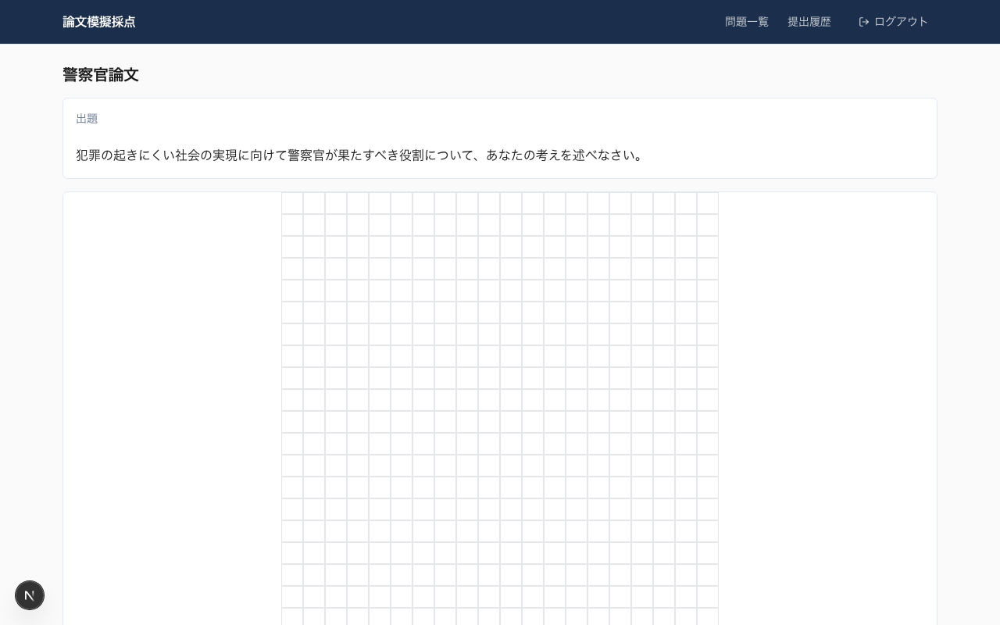

</details>

### 1-3. 提出 → AI採点（数秒〜十数秒）

「提出する」ボタン → 確認ダイアログ → 提出完了。採点中はスピナーが表示され、**2秒間隔のポーリングで自動的に結果画面へ遷移**します。

<details>
<summary>スクリーンショット: 採点中画面</summary>

答案テキストを表示しながら、AIの採点完了を待機します。

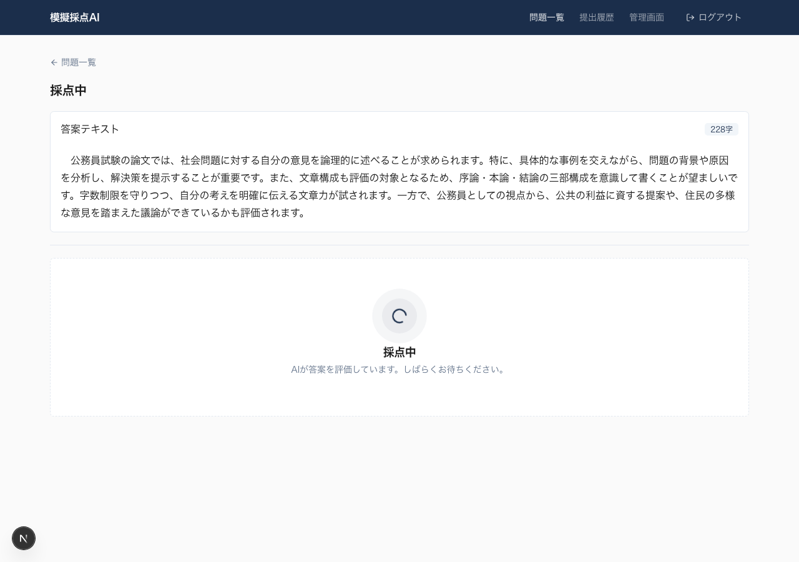

</details>

### 1-4. 採点結果の閲覧

採点が完了すると、**左カラムに自分の答案、右カラムにAIの評価結果**が並列で表示されます。

#### フィードバックの見せ方

各評価項目について以下の情報がカード形式で表示されます:

- **評価観点名**（例: 「題材の選び方」「現状把握」）
- **良好/改善点アイコン** — 緑のチェックマークまたはオレンジの警告アイコン
- **概要テキスト** — AIが選んだ選択肢の要約（太字・1行）
- **詳細フィードバック** — その選択肢に紐づく具体的な講評文（背景付きボックス）

ページ上部には「すべての評価項目で良好な結果です」または「X件の改善点があります」のサマリーが表示されます。

<details>
<summary>スクリーンショット: 採点結果画面（デスクトップ）</summary>

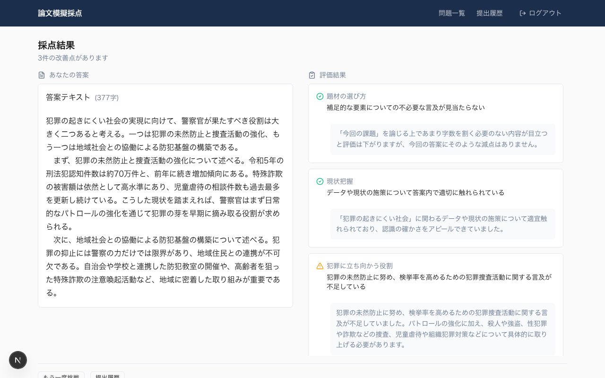

**全体表示:**

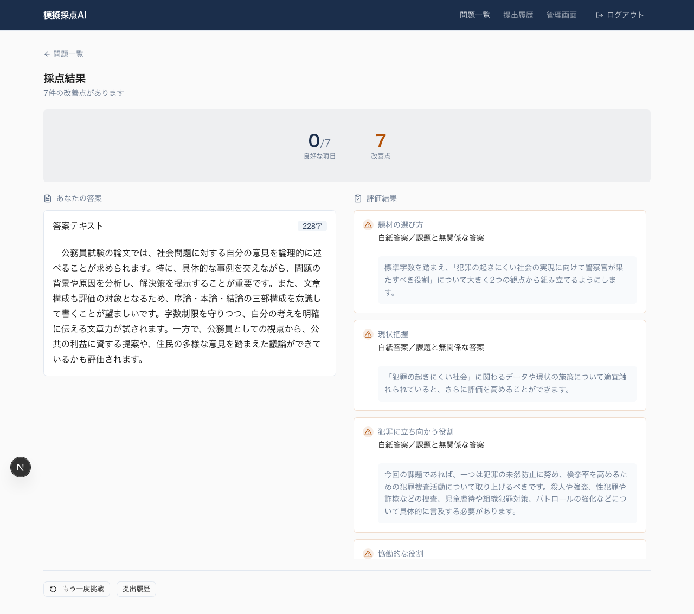

</details>

<details>
<summary>スクリーンショット: 採点結果画面（モバイル）</summary>

768px未満では1カラムの縦積みレイアウトに自動切替。

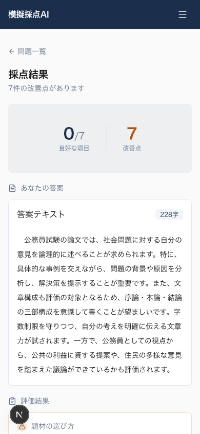

</details>

### 1-5. 提出履歴

過去の全提出を一覧で確認できます。問題名クリックで過去の結果画面へいつでも戻れます。

<details>
<summary>スクリーンショット: 提出履歴</summary>

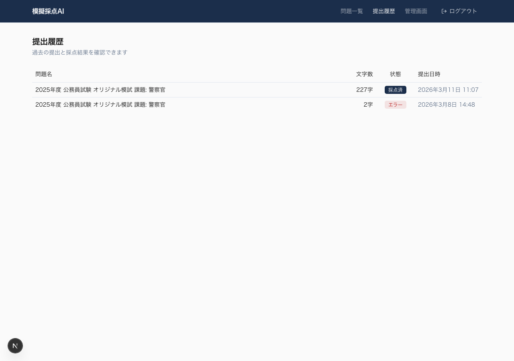

</details>

---

## 2. 管理者の運用フロー

### 2-1. 問題の追加方法

管理者アカウントでログインすると、ヘッダーに「管理」バッジが表示され、管理画面にアクセスできます。

**問題追加の流れ:**

1. 「問題管理」→「+ 新規作成」をクリック
2. タイトル・出題文・標準字数を入力して「作成」
3. 作成された問題の編集画面へ遷移
4. 「+ セクションを追加」で評価観点を1つずつ追加（例: 「題材の選び方」「現状把握」…）
5. 各セクションを展開して選択肢（要約＋フィードバック文）を追加

**または**、Markdown形式で評価基準を一括インポートするAPIも利用可能です（`POST /api/admin/import`）。

<details>
<summary>スクリーンショット: 問題管理（一覧）</summary>

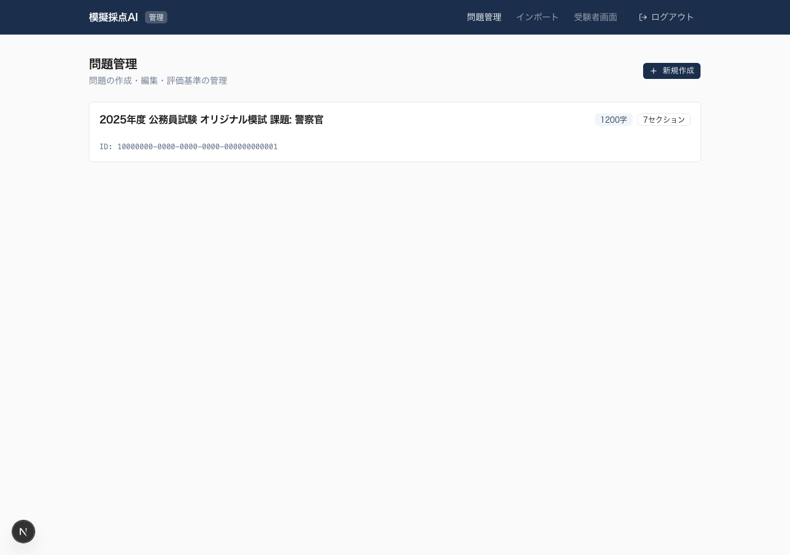

</details>

<details>
<summary>スクリーンショット: 問題新規作成</summary>

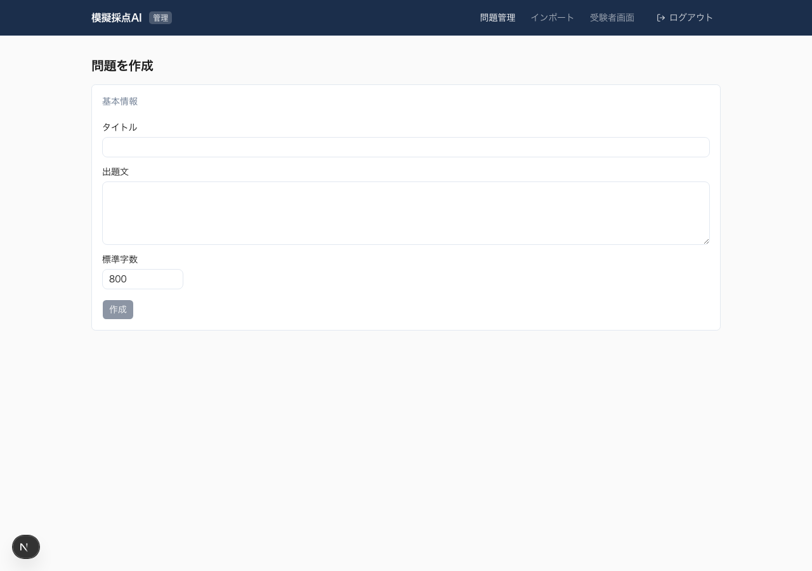

</details>

<details>
<summary>スクリーンショット: 問題編集（セクション・選択肢管理）</summary>

7つの評価セクションと、それぞれに紐づく選択肢（2〜13件）を管理できます。各セクションは折りたたみ可能。

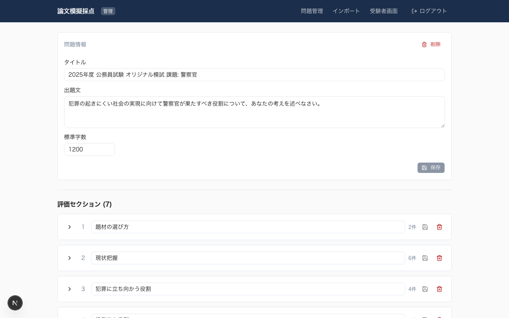

**全体表示:**

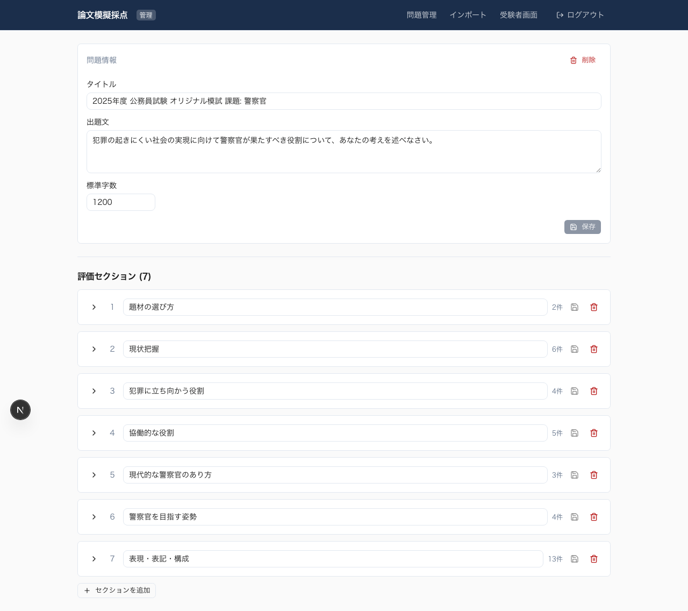

</details>

### 2-2. 評価基準の出典と設計思想

本デモで使用している**試験問題・7つの評価観点・各選択肢の概要テキストと詳細フィードバック文・解答例・人手による正解ラベリング**は、すべてご提供いただいたデータをそのまま組み込んでいます。

AIは「自由記述」で採点するのではなく、**あらかじめ設計された選択肢の中から最も適切なものを1つ選ぶ**方式です。

```
評価セクション（例: 7つ）
  └── 選択肢（例: セクションごとに2〜13個）
        ├── 要約（1行の概要テキスト）
        └── フィードバック文（受験者に表示する詳細な講評）
```

この設計により:
- AIの出力が**事前に定義された範囲内**に必ず収まる
- フィードバックの品質が**人間が書いた文章**で担保される
- AIが突飛なことを言うリスクがゼロ
- 問題を追加する際も、**同じフォーマットでデータを用意すればそのまま登録可能**

---

## 3. AI採点の精度検証

### テスト方法

ご提供いただいた**解答例2本と、それに対する人手の正解ラベリング**（7セクション×1選択肢 = 7個の期待値）を基準として、AIがどれだけ一致するかを検証しました。

**テストデータ:**

| 解答例 | 文字数 | 内容の特徴 |
|--------|--------|-----------|
| 解答例1 | 935字 | 巡回連絡による地域警察活動＋防犯ネットワーク構築。多面的で整った答案 |
| 解答例2 | 663字 | トー横キッズ問題に焦点を当てたパトロール中心の答案。字数不足あり |

### 最終結果（Claude Sonnet 4.6、Batch方式）

**解答例1（935字）: 71%（5/7一致）**

| 評価観点 | 人間の判定 | AIの判定 | 結果 |
|---------|:---------:|:-------:|:---:|
| 題材の選び方 | 11（不必要な言及なし） | 11 | 一致 |
| 現状把握 | 21（適切に触れている） | 23（分量不足） | **不一致** |
| 犯罪に立ち向かう役割 | 32（適切に言及） | 32 | 一致 |
| 協働的な役割 | 41（多面的に適切） | 42（体制○意識×） | **不一致** |
| 現代的な警察官のあり方 | 51（適切） | 51 | 一致 |
| 警察官を目指す姿勢 | 61（適切） | 61 | 一致 |
| 表現・表記・構成 | 72（その他の問題点あり） | 72 | 一致 |

**解答例2（663字）: 86%（6/7一致）**

| 評価観点 | 人間の判定 | AIの判定 | 結果 |
|---------|:---------:|:-------:|:---:|
| 題材の選び方 | 11（不必要な言及なし） | 11 | 一致 |
| 現状把握 | 25（該当なし） | 25 | 一致 |
| 犯罪に立ち向かう役割 | 32（適切に言及） | 32 | 一致 |
| 協働的な役割 | 43（協働意識のみ○） | 43 | 一致 |
| 現代的な警察官のあり方 | 51（適切） | 51 | 一致 |
| 警察官を目指す姿勢 | 62（積極性が見えない） | 63（該当なし） | **不一致** |
| 表現・表記・構成 | 78（字数不足） | 78 | 一致 |

### 不一致箇所の分析

残る不一致は**判断が分かれやすい微妙なケース**です:

- **解答例1・評価2**: 現状のデータに「適切に触れている」か「分量が不足」かの境界。AIがやや厳しめに判定
- **解答例1・評価4**: 「防犯体制の構築」と「防犯意識の向上」の両方に言及しているかの判断。微妙な文脈読み取りが必要
- **解答例2・評価6**: 「警察官になりたい姿勢」が読み取れるかどうか。AIが「見えない」寄りに判定

いずれもAIの判定が「完全に的外れ」なケースはなく、**隣接する選択肢を選んでいる**状態です。

---

## 4. プロンプト設計の経緯と最終形

### 検証した3つの方式

| 方式 | 説明 | 解答例1 | 解答例2 | 採用 |
|------|------|:------:|:------:|:---:|
| **Batch（一括）** | 全7セクション + 全選択肢を1リクエストで送信 | 71% | 86% | **採用** |
| Per-section（セクション別） | セクションごとに個別リクエスト（7並列） | 43% | 43% | 不採用 |
| Few-shot（例示付き） | 模範解答1を例示し、解答例2を採点 | — | 29% | 不採用 |

**Per-section** は他セクションの文脈が失われるため精度が低下。**Few-shot** は模範解答にバイアスがかかり一貫して悪化しました。

### 精度改善の経緯

| 施策 | 効果 |
|------|------|
| 選択肢の `feedback_text`（詳細講評文）をプロンプトに追加 | 解答例2: 29%→57% |
| 講評データの表現を人間が修正 | 解答例1: 43%→57% |
| 答案文字数・標準字数をプロンプトに注入 | 評価7（表現・表記・構成）の精度改善 |
| Sonnet 4 → Sonnet 4.6へ切り替え | 解答例1: 57%→71%、解答例2: 86%→100%（過去最良時） |

### モデル選定

| モデル | 入力単価 | 出力単価 | 採用判断 |
|--------|:-------:|:-------:|:-------:|
| Claude Haiku 4.5 | $1/MTok | $5/MTok | 安価だが精度不足の懸念 |
| **Claude Sonnet 4.6** | **$3/MTok** | **$15/MTok** | **採用: Sonnet 4と同一料金で精度向上** |
| Claude Opus 4.6 | $5/MTok | $25/MTok | 高精度だがコスト1.67倍 |

Sonnet 4.6はSonnet 4と**全く同じ料金**で精度が大幅改善されるため、ノーリスクで採用しました。

### 最終プロンプト構造

```
あなたは公務員試験の論文採点官です。
以下の答案を読み、各評価セクションから最も適切な選択肢を1つずつ選んでください。

【出題】
{出題文}

【答案】
{答案テキスト}

【参考情報】
- この答案の文字数: {実測値}字
- 標準字数: {管理者設定値}字

【評価セクション・選択肢】
■ 評価1: 題材の選び方
- 11: {要約}
  詳細: {フィードバック文}
- 12: {要約}
  詳細: {フィードバック文}
...（全7セクション・全選択肢）

【回答形式】
以下のJSON形式のみで回答してください。説明は不要です：
{"results": [{"section": 1, "choice_number": 11}, ...]}
```

---

## 5. 運用コスト

### 1回の採点コスト

| 項目 | トークン数 | コスト |
|------|-----------|--------|
| 入力（出題文 + 答案 + 全評価基準） | 約2,300〜4,100 tokens | 約$0.007〜$0.012 |
| 出力（JSON結果） | 約80〜120 tokens | 約$0.001〜$0.002 |
| **合計** | — | **約$0.01（約1.5円）** |

### 月額目安

| 規模 | 月間採点回数 | Claude API | Supabase | 合計 |
|------|-----------|:----------:|:--------:|:----:|
| 個人利用 | 50回 | 約80円 | 無料 | **約80円** |
| 小規模運営 | 500回 | 約800円 | 無料 | **約800円** |
| 中規模運営 | 5,000回 | 約8,000円 | 約4,000円 | **約12,000円** |

※ リトライ発生時は最大3倍。Supabase Proプラン（$25/月〜）は中規模以上で必要。

---

## 6. 技術構成

| レイヤー | 技術 | 選定理由 |
|---------|------|---------|
| フロントエンド | Next.js 16 + React 19 + TypeScript | SSR/SSG対応、型安全 |
| スタイリング | Tailwind CSS 4 + shadcn/ui | 高速なUI開発、一貫したデザイン |
| データベース | Supabase (PostgreSQL) | 認証・RLSが統合済み、マネージド |
| AI採点 | Anthropic Claude API (Sonnet 4.6) | 日本語理解力、JSON出力の安定性 |
| デプロイ | Vercel（想定） | Next.jsとの最適統合 |

<details>
<summary>システムアーキテクチャ図</summary>

```
ブラウザ ──→ Next.js (Vercel) ──→ Supabase (PostgreSQL + Auth)
                  │
                  └──→ Claude API (採点、after() APIで非同期実行)
```

**採点フロー:**
1. 受験者が答案を提出（POST /api/submissions）
2. APIがDB保存後、即座にレスポンスを返却
3. `after()` APIでバックグラウンド採点を開始
4. Claude APIに評価基準 + 答案を送信 → JSON結果を取得
5. 結果をDBに保存（評価基準のスナップショット付き）
6. 受験者のブラウザが2秒間隔ポーリングで結果を検知 → 表示

</details>

<details>
<summary>環境変数</summary>

| 変数名 | 説明 |
|--------|------|
| `NEXT_PUBLIC_SUPABASE_URL` | Supabaseプロジェクト URL |
| `NEXT_PUBLIC_SUPABASE_ANON_KEY` | Supabase匿名キー（公開可） |
| `SUPABASE_SERVICE_ROLE_KEY` | Supabaseサービスロールキー（サーバー専用） |
| `ANTHROPIC_API_KEY` | Anthropic APIキー |

</details>

---

## 7. データベース設計

6テーブル構成。管理者が評価基準を変更しても、過去の採点結果が壊れないよう**結果テーブルにスナップショット**を保存しています。

<details>
<summary>テーブル一覧と関連</summary>

| テーブル | 用途 |
|---------|------|
| `users` | ユーザー情報（admin / examinee ロール） |
| `exams` | 試験問題（タイトル・出題文・標準字数） |
| `evaluation_sections` | 評価セクション（試験ごとに複数） |
| `evaluation_choices` | 各セクションの選択肢（要約＋フィードバック文） |
| `submissions` | 答案提出（テキスト・文字数・ステータス） |
| `submission_results` | 採点結果（AIが選んだ選択肢 + 評価基準スナップショット） |

**選択肢の番号体系:** セクション番号×10 + 連番。例: セクション1 → 11, 12, 13 / セクション2 → 21, 22, 23…
各セクションの最初の選択肢（x1）が「良好」評価。

</details>

---

## 8. セキュリティ・認証

| 項目 | 実装 |
|------|------|
| 認証 | Supabase Auth（メール/パスワード、HTTPOnly Cookie） |
| ロール分離 | admin / examinee の2ロール。管理APIは全て `checkAdmin()` ガード |
| データ保護 | Row Level Security、結果スナップショット、APIキーはサーバー側のみ |

### テストアカウント

| ロール | メールアドレス | パスワード |
|--------|-------------|-----------|
| 管理者 | `admin@test.com` | `password123` |
| 受験者 | `examinee@test.com` | `password123` |

---

## 9. 今後の開発計画

### 優先度高

| 項目 | 説明 |
|------|------|
| **問題インポートUI** | ご提供いただくデータフォーマットに合わせた評価基準の一括登録機能。管理画面の問題追加ページはすでに実装済みで、インポート機能を接続すればすぐに新しい問題を追加できる状態 |
| **多重提出防止** | 採点中に同じ問題への再提出をブロック |

### 優先度中

| 項目 | 説明 |
|------|------|
| 提出履歴のページネーション | 件数が増えた場合の分割読み込み |
| 検索・フィルタ | 問題名や日付での絞り込み |
| AI精度の継続改善 | 評価基準の文言チューニング、不一致箇所の分析 |

### 将来構想

| 項目 | 説明 |
|------|------|
| PDF出力 | 採点結果のレポートダウンロード |
| 分析ダッシュボード | 利用統計・採点傾向の可視化 |
| 複数試験対応の拡充 | 異なる試験種別（国家・地方・警察・消防等） |

---

最終更新: 2026-03-08
