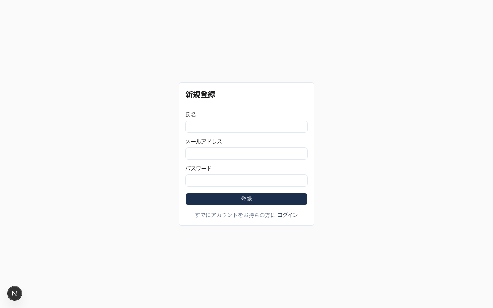

# 論文模擬採点サービス — デモ説明資料

> 公務員試験の論文対策に特化した、AI自動採点Webアプリケーション

---

## 目次

1. [サービス概要](#サービス概要)
2. [機能一覧](#機能一覧)
3. [技術スタック](#技術スタック)
4. [外部サービス・API](#外部サービスapi)
5. [画面紹介（スクリーンショット付き）](#画面紹介)
6. [システムアーキテクチャ](#システムアーキテクチャ)
7. [データベース設計](#データベース設計)
8. [AI採点エンジン](#ai採点エンジン)
9. [コスト試算](#コスト試算)
10. [アカウント体系](#アカウント体系)
11. [API一覧](#api一覧)
12. [セキュリティ](#セキュリティ)
13. [今後の拡張余地](#今後の拡張余地)

---

## サービス概要

**論文模擬採点**は、公務員試験の論文試験対策として、受験者が執筆した答案をAI（Claude）が多角的に自動採点するWebサービスです。

### 想定ユーザー

| ロール | 説明 |
|--------|------|
| **受験者（examinee）** | 論文を執筆・提出し、AI採点結果を受け取る |
| **管理者（admin）** | 試験問題・評価基準の作成・管理を行う |

### コアバリュー

- 原稿用紙風エディタで実際の試験に近い執筆体験
- 提出後数秒〜十数秒でAIによる多観点フィードバックを取得
- 評価基準は管理者が自由に設計可能（セクション×選択肢の構造）

---

## 機能一覧

### 受験者向け機能

| 機能 | 説明 | 状態 |
|------|------|------|
| ユーザー登録・ログイン | メール/パスワード認証 | 実装済 |
| 問題一覧 | 受験可能な試験問題を閲覧 | 実装済 |
| 原稿用紙風エディタ | 20列グリッドで論文を執筆。カーソル移動・文字数カウント付き | 実装済 |
| 答案提出 | 確認ダイアログ後にAI採点を開始 | 実装済 |
| リアルタイム採点状態表示 | 2秒間隔ポーリングで採点進捗を表示 | 実装済 |
| 採点結果閲覧 | 2カラムレイアウトで答案と評価を並列表示 | 実装済 |
| 提出履歴 | 過去の提出一覧（問題名・文字数・状態・日時） | 実装済 |

### 管理者向け機能

| 機能 | 説明 | 状態 |
|------|------|------|
| 問題CRUD | タイトル・出題文・標準字数の作成/編集/削除 | 実装済 |
| 評価セクション管理 | 評価観点（セクション）の追加/編集/削除 | 実装済 |
| 評価選択肢管理 | 各セクションの選択肢（要約＋フィードバック文）の追加/編集/削除 | 実装済 |
| Markdownインポート | 評価基準をMarkdown形式で一括登録（API実装済み、UI未実装） | API済/UI未 |

---

## 技術スタック

### フロントエンド

| 技術 | バージョン | 用途 |
|------|-----------|------|
| **Next.js** | 16.1.6 | フルスタックReactフレームワーク（App Router） |
| **React** | 19.2.3 | UIライブラリ |
| **TypeScript** | 5.x | 型安全な開発 |
| **Tailwind CSS** | 4.x | ユーティリティファーストCSS |
| **shadcn/ui** | 最新 | UIコンポーネントライブラリ（Radix UI + Tailwind） |
| **Lucide React** | — | アイコンライブラリ |

<details>
<summary>shadcn/ui コンポーネント使用一覧</summary>

- `Alert Dialog` — 提出確認ダイアログ
- `Badge` — 採点状態ラベル
- `Button` — 各種ボタン
- `Card` — 答案表示・試験カード
- `Collapsible` — 管理画面セクション折りたたみ
- `Input` — テキスト入力
- `Label` — フォームラベル
- `Separator` — 区切り線
- `Skeleton` — ローディング表示
- `Table` — 提出履歴テーブル
- `Tabs` — タブ切り替え
- `Textarea` — 出題文入力

</details>

### バックエンド

| 技術 | 用途 |
|------|------|
| **Next.js API Routes** | RESTful APIエンドポイント |
| **Next.js `after()` API** | 答案提出レスポンス後にバックグラウンドで採点処理を起動 |
| **Supabase JS Client** | データベースアクセス（ORM不使用、直接クエリ） |

### インフラ・デプロイ

| 技術 | 用途 |
|------|------|
| **Vercel**（想定） | Next.jsホスティング・CDN |
| **Supabase** | PostgreSQLデータベース＋認証基盤（マネージド） |

---

## 外部サービス・API

### 1. Supabase

| 項目 | 詳細 |
|------|------|
| **用途** | PostgreSQLデータベース、認証（Auth）、Row Level Security |
| **プラン** | Free / Pro（プロジェクト規模に応じて選択） |
| **認証方式** | メール/パスワード認証（Supabase Auth） |
| **接続方式** | `@supabase/ssr` パッケージ（サーバー/クライアント双方で利用） |

<details>
<summary>Supabase クライアント構成</summary>

| クライアント | ファイル | 用途 |
|-------------|---------|------|
| ブラウザ用 | `src/lib/supabase/client.ts` | クライアントコンポーネントからのデータ取得・認証 |
| サーバー用 | `src/lib/supabase/server.ts` | サーバーコンポーネント・API Routeからのデータ取得 |
| 管理用 | `src/lib/supabase/admin.ts` | Service Role Keyを使用した管理操作（ユーザー作成等） |
| ミドルウェア用 | `src/lib/supabase/middleware.ts` | リクエストごとのセッション更新 |

</details>

### 2. Anthropic Claude API

| 項目 | 詳細 |
|------|------|
| **用途** | 論文の自動採点（AI評価エンジン） |
| **使用モデル** | `claude-sonnet-4-6`（Claude Sonnet 4.6） |
| **SDK** | `@anthropic-ai/sdk`（公式Node.js SDK） |
| **最大出力トークン** | 1,024 tokens / リクエスト |
| **リトライ** | 最大3回（初回 + 2回リトライ、リトライ間隔2秒） |

<details>
<summary>API呼び出しの詳細フロー</summary>

1. 答案提出APIが呼ばれる
2. `after()` APIでレスポンス送信後にバックグラウンド処理を開始
3. DBから試験データ・評価セクション・選択肢を取得
4. プロンプトを構築（出題文 + 答案 + 評価基準）
5. Claude Sonnet 4にリクエスト送信
6. JSON形式のレスポンスをパース・バリデーション
7. 結果をDBに保存（選択肢スナップショット付き）
8. 提出ステータスを `evaluated` に更新

</details>

### 環境変数

| 変数名 | 説明 |
|--------|------|
| `NEXT_PUBLIC_SUPABASE_URL` | Supabaseプロジェクト URL |
| `NEXT_PUBLIC_SUPABASE_ANON_KEY` | Supabase匿名キー（公開可） |
| `SUPABASE_SERVICE_ROLE_KEY` | Supabaseサービスロールキー（サーバー専用） |
| `ANTHROPIC_API_KEY` | Anthropic APIキー |

---

## 画面紹介

### 認証画面

<details>
<summary>ログイン画面</summary>

メールアドレスとパスワードで認証します。新規登録リンクから登録画面へ遷移可能です。


</details>

<details>
<summary>新規登録画面</summary>

名前・メールアドレス・パスワードを入力して受験者アカウントを作成します。



</details>

### 受験者画面

<details>
<summary>問題一覧</summary>

受験可能な試験問題を一覧表示します。各カードにはタイトル・標準字数・出題文のプレビューが表示されます。


</details>

<details>
<summary>原稿用紙風エディタ</summary>

20列のグリッドレイアウトで、実際の原稿用紙に近い執筆体験を提供します。

**特徴:**
- 20列 × 可変行のグリッドセル
- クリック/キーボードによるカーソル移動
- リアルタイム文字数カウント（改行除外）
- 標準字数に対する色分け表示（80〜110%が緑、それ以外が赤）
- 先頭の全角スペース自動挿入


</details>

<details>
<summary>採点中画面</summary>

答案提出後、AIが採点処理を行っている間の待機画面です。2秒間隔のポーリングで自動的に結果画面へ遷移します。


</details>

<details>
<summary>採点結果画面（デスクトップ）</summary>

左カラムに答案テキスト、右カラムに評価結果を並列表示します。各カラムは独立スクロール可能です。

**表示要素:**
- 総合サマリー（「すべての評価項目で良好な結果です」or「X件の改善点があります」）
- カラムヘッダー（アイコン付き、stickyで固定）
- 各評価セクション（アイコンで良好/改善点を識別）
- 概要テキスト + 詳細フィードバック（背景色で視覚的に区別）
- ナビゲーションボタン（スクロール外に固定配置）


**全体表示:**


</details>

<details>
<summary>採点結果画面（モバイル）</summary>

768px未満では1カラムの縦積みレイアウトに切り替わります。


</details>

<details>
<summary>提出履歴</summary>

過去の提出を一覧で確認できます。問題名をクリックすると結果画面へ遷移します。


</details>

### 管理者画面

<details>
<summary>問題管理（一覧）</summary>

登録済みの問題一覧を表示します。各問題にはタイトル・標準字数・評価セクション数が表示されます。


</details>

<details>
<summary>問題管理（編集）</summary>

問題のメタ情報（タイトル・出題文・標準字数）と、紐づく評価セクションを管理します。各セクションは折りたたみ可能で、選択肢の追加・編集・削除ができます。


**全体表示（7セクション）:**


</details>

<details>
<summary>問題新規作成</summary>

タイトル・出題文・標準字数を入力して新しい試験問題を作成します。


</details>

---

## システムアーキテクチャ

```
┌──────────────┐     ┌───────────────────────┐     ┌──────────────┐
│              │     │     Next.js App        │     │              │
│   ブラウザ    │────▶│  (Vercel / Node.js)   │────▶│   Supabase   │
│  (React SPA) │◀────│                       │◀────│ (PostgreSQL) │
│              │     │  ┌─────────────────┐  │     │              │
└──────────────┘     │  │  API Routes     │  │     └──────────────┘
                     │  │  (/api/*)       │  │
                     │  └────────┬────────┘  │     ┌──────────────┐
                     │           │           │     │              │
                     │  ┌────────▼────────┐  │────▶│ Anthropic    │
                     │  │ Grading Engine  │  │◀────│ Claude API   │
                     │  │ (after() API)   │  │     │              │
                     │  └─────────────────┘  │     └──────────────┘
                     └───────────────────────┘
```

### リクエストフロー（採点）

```
1. ブラウザ → POST /api/submissions (答案テキスト送信)
2. API Route → Supabase: submissions テーブルに INSERT (status: "pending")
3. API Route → レスポンス返却 (submission_id)
4. after() → status を "evaluating" に更新
5. after() → 評価セクション・選択肢を取得
6. after() → Claude API にプロンプト送信
7. after() → レスポンスをパース・バリデーション
8. after() → submission_results テーブルに INSERT
9. after() → status を "evaluated" に更新
10. ブラウザ → GET /api/submissions/:id/status (2秒間隔ポーリング)
11. ブラウザ → status が "evaluated" になったら結果を取得・表示
```

---

## データベース設計

### ER図（論理構造）

```
users ─────────────────────┐
  id (PK, UUID)            │
  email                    │
  name                     │
  role (admin | examinee)  │
  created_at               │
                           │
exams ─────────────────────┼── submissions
  id (PK, UUID)            │     id (PK, UUID)
  title                    │     exam_id (FK → exams)
  prompt_text              │     user_id (FK → users)
  standard_char_count      │     answer_text
  created_by (FK → users)  │     char_count
  created_at               │     status (pending|evaluating|evaluated|error)
                           │     error_message
evaluation_sections ───────┤     submitted_at
  id (PK, UUID)            │     evaluated_at
  exam_id (FK → exams)     │
  section_number           │── submission_results
  title                    │     id (PK, UUID)
                           │     submission_id (FK → submissions)
evaluation_choices ────────┘     section_id (FK → evaluation_sections)
  id (PK, UUID)                  selected_choice_id (FK → evaluation_choices)
  section_id (FK → sections)     section_title (スナップショット)
  choice_number                  section_number (スナップショット)
  summary                        choice_summary (スナップショット)
  feedback_text                  choice_feedback_text (スナップショット)
                                 selected_choice_number (スナップショット)
                                 created_at
```

### テーブル詳細

<details>
<summary>users テーブル</summary>

| カラム | 型 | 説明 |
|--------|-----|------|
| `id` | UUID (PK) | Supabase Auth のユーザーID |
| `email` | TEXT | メールアドレス |
| `name` | TEXT | 表示名 |
| `role` | TEXT | `admin` または `examinee` |
| `created_at` | TIMESTAMPTZ | 作成日時 |

</details>

<details>
<summary>exams テーブル</summary>

| カラム | 型 | 説明 |
|--------|-----|------|
| `id` | UUID (PK) | 試験ID |
| `title` | TEXT | 試験タイトル |
| `prompt_text` | TEXT | 出題文 |
| `standard_char_count` | INTEGER | 標準字数（例: 1200） |
| `created_by` | UUID (FK) | 作成した管理者のID |
| `created_at` | TIMESTAMPTZ | 作成日時 |

</details>

<details>
<summary>evaluation_sections テーブル</summary>

| カラム | 型 | 説明 |
|--------|-----|------|
| `id` | UUID (PK) | セクションID |
| `exam_id` | UUID (FK) | 所属する試験 |
| `section_number` | INTEGER | セクション番号（1〜7など） |
| `title` | TEXT | 評価観点名（例: 「題材の選び方」） |

</details>

<details>
<summary>evaluation_choices テーブル</summary>

| カラム | 型 | 説明 |
|--------|-----|------|
| `id` | UUID (PK) | 選択肢ID |
| `section_id` | UUID (FK) | 所属するセクション |
| `choice_number` | INTEGER | 選択肢番号（例: 11, 12, 13…） |
| `summary` | TEXT | 選択肢の要約（1行の概要） |
| `feedback_text` | TEXT | 詳細フィードバックテキスト |

**番号体系:** `choice_number` はセクション番号×10 + 連番で構成。
例: セクション1の選択肢 → 11, 12, 13 / セクション2 → 21, 22, 23…
各セクションの最初の選択肢（x1）が「良好」評価を示す。

</details>

<details>
<summary>submissions テーブル</summary>

| カラム | 型 | 説明 |
|--------|-----|------|
| `id` | UUID (PK) | 提出ID |
| `exam_id` | UUID (FK) | 対象試験 |
| `user_id` | UUID (FK) | 提出者 |
| `answer_text` | TEXT | 答案テキスト全文 |
| `char_count` | INTEGER | 文字数（改行除外） |
| `status` | TEXT | `pending` / `evaluating` / `evaluated` / `error` |
| `error_message` | TEXT (NULLABLE) | エラー発生時のメッセージ |
| `submitted_at` | TIMESTAMPTZ | 提出日時 |
| `evaluated_at` | TIMESTAMPTZ (NULLABLE) | 採点完了日時 |

</details>

<details>
<summary>submission_results テーブル</summary>

| カラム | 型 | 説明 |
|--------|-----|------|
| `id` | UUID (PK) | 結果ID |
| `submission_id` | UUID (FK) | 対象提出 |
| `section_id` | UUID (FK) | 評価セクション |
| `selected_choice_id` | UUID (FK) | AIが選んだ選択肢 |
| `section_title` | TEXT (NULLABLE) | 採点時点のセクション名（スナップショット） |
| `section_number` | INTEGER (NULLABLE) | 採点時点のセクション番号（スナップショット） |
| `choice_summary` | TEXT (NULLABLE) | 採点時点の選択肢要約（スナップショット） |
| `choice_feedback_text` | TEXT (NULLABLE) | 採点時点のフィードバック本文（スナップショット） |
| `selected_choice_number` | INTEGER (NULLABLE) | 採点時点の選択肢番号（スナップショット） |
| `created_at` | TIMESTAMPTZ | 作成日時 |

**スナップショット設計:** 管理者が評価基準を変更しても、過去の採点結果は変わらないよう、採点時点のデータをコピー保存しています。

</details>

---

## AI採点エンジン

### 使用モデル

| 項目 | 値 |
|------|-----|
| モデル | `claude-sonnet-4-6`（Claude Sonnet 4.6） |
| 最大出力トークン | 1,024 |
| Temperature | デフォルト（指定なし） |

### プロンプト構造

```
あなたは公務員試験の論文採点官です。
以下の答案を読み、各評価セクションから最も適切な選択肢を1つずつ選んでください。

【出題】
{出題文}

【答案】
{答案テキスト}

【評価セクション・選択肢】
■ 評価1: 題材の選び方
- 11: 補足的な要素についての不必要な言及が見当たらない
  詳細: 「今回の課題」を論じる上で...
- 12: 補足的な要素に字数を割きすぎている
  詳細: ...
■ 評価2: 現状把握
...

【回答形式】
以下のJSON形式のみで回答してください。説明は不要です：
{"results": [{"section": 1, "choice_number": 11}, {"section": 2, "choice_number": 21}, ...]}
```

### レスポンスバリデーション

1. JSONとしてパース可能か
2. `results` 配列が存在するか
3. 全セクション分の結果があるか
4. 各 `section` 番号が実在するか
5. 各 `choice_number` がそのセクションに属するか

バリデーション失敗時はリトライ（最大3回、2秒間隔）。

### Few-shot対応

`buildFewShotGradingPrompt` 関数が実装済みで、例題（模範答案＋判定結果）を含めた精度向上プロンプトにも対応可能です。

---

## コスト試算

### Claude API コスト

Claude Sonnet 4 の料金体系（2025年5月時点）:

| 項目 | 単価 |
|------|------|
| 入力トークン | $3.00 / 100万トークン |
| 出力トークン | $15.00 / 100万トークン |

### 1回の採点あたりの推定コスト

<details>
<summary>詳細な推定計算</summary>

**入力トークン（プロンプト）の内訳:**

| 要素 | 推定文字数 | 推定トークン数 |
|------|-----------|--------------|
| システム指示・フォーマット | 約200字 | 約150 tokens |
| 出題文 | 約50〜100字 | 約80 tokens |
| 答案テキスト | 約800〜1,200字 | 約600〜900 tokens |
| 評価セクション×7 + 選択肢（各2〜13件） | 約2,000〜4,000字 | 約1,500〜3,000 tokens |
| **合計（入力）** | — | **約2,300〜4,100 tokens** |

**出力トークン:**

| 要素 | 推定トークン数 |
|------|--------------|
| JSON結果（7セクション分） | 約80〜120 tokens |

**1回あたりのコスト計算（典型的なケース: 入力3,000 / 出力100 tokens）:**

```
入力: 3,000 tokens × $3.00 / 1,000,000 = $0.009
出力: 100 tokens × $15.00 / 1,000,000 = $0.0015
合計: 約 $0.0105（約1.6円 @ 150円/ドル）
```

</details>

| 規模 | 月間採点回数 | 推定月額コスト |
|------|------------|--------------|
| 個人利用 | 50回 | 約 $0.53（約80円） |
| 小規模運営 | 500回 | 約 $5.3（約800円） |
| 中規模運営 | 5,000回 | 約 $53（約8,000円） |

※ リトライが発生した場合、最大3倍のAPI呼び出しが発生します。
※ Supabase のコスト（Free: $0 / Pro: $25/月〜）は別途かかります。

### Supabase コスト

| プラン | 月額 | 含まれるもの |
|--------|------|------------|
| Free | $0 | 500MB DB, 50,000 MAU, 2GBストレージ |
| Pro | $25〜 | 8GB DB, 100,000 MAU, 100GBストレージ |

---

## アカウント体系

### ロール

| ロール | 権限 |
|--------|------|
| `examinee`（受験者） | 問題閲覧、答案提出、結果閲覧、履歴閲覧 |
| `admin`（管理者） | 上記すべて + 問題CRUD、評価基準管理、インポート |

### テストアカウント

開発・デモ用に以下のテストアカウントが用意されています:

| 用途 | メールアドレス | パスワード | ロール |
|------|-------------|-----------|--------|
| 管理者テスト | `admin@test.com` | `password123` | admin |
| 受験者テスト | `examinee@test.com` | `password123` | examinee |

テストアカウントは `scripts/seed-test-accounts.ts` で作成できます:

```bash
npx tsx scripts/seed-test-accounts.ts
```

### 認証フロー

```
1. ユーザーがログインフォームにメール/パスワードを入力
2. Supabase Auth がセッションを発行（Cookie保存）
3. Next.js Middleware が全リクエストでセッションをリフレッシュ
4. サーバーコンポーネント/API Route が supabase.auth.getUser() で認証確認
5. 管理者ページは追加で users.role == "admin" を検証
```

---

## API一覧

### 認証API

| メソッド | エンドポイント | 認証 | 説明 |
|---------|-------------|------|------|
| POST | `/api/auth/signup` | 不要 | ユーザー新規登録 |

### 提出API

| メソッド | エンドポイント | 認証 | 説明 |
|---------|-------------|------|------|
| POST | `/api/submissions` | 必須 | 答案提出＋採点開始 |
| GET | `/api/submissions/:id/status` | 必須 | 採点状態ポーリング |
| POST | `/api/submissions/:id/retry` | 必須 | 採点リトライ（エラー時） |

<details>
<summary>POST /api/submissions — リクエスト/レスポンス例</summary>

**リクエスト:**
```json
{
  "exam_id": "10000000-0000-0000-0000-000000000001",
  "answer_text": "犯罪の起きにくい社会の実現に向けて..."
}
```

**レスポンス (200):**
```json
{
  "submission_id": "c9eb4be1-daf9-4cf2-bc9b-af45eb57eb80"
}
```

</details>

<details>
<summary>GET /api/submissions/:id/status — レスポンス例</summary>

```json
{
  "status": "evaluated",
  "error_message": null
}
```

ステータス値: `pending` → `evaluating` → `evaluated` / `error`

</details>

### 管理API

| メソッド | エンドポイント | 認証 | 説明 |
|---------|-------------|------|------|
| GET | `/api/admin/exams` | Admin | 試験一覧取得 |
| POST | `/api/admin/exams` | Admin | 試験作成 |
| GET | `/api/admin/exams/:id` | Admin | 試験詳細取得（セクション・選択肢含む） |
| PUT | `/api/admin/exams/:id` | Admin | 試験メタ情報更新 |
| DELETE | `/api/admin/exams/:id` | Admin | 試験削除（カスケード） |
| POST | `/api/admin/sections` | Admin | 評価セクション作成 |
| PUT | `/api/admin/sections/:id` | Admin | 評価セクション更新 |
| DELETE | `/api/admin/sections/:id` | Admin | 評価セクション削除（カスケード） |
| POST | `/api/admin/choices` | Admin | 評価選択肢作成 |
| PUT | `/api/admin/choices/:id` | Admin | 評価選択肢更新 |
| DELETE | `/api/admin/choices/:id` | Admin | 評価選択肢削除 |
| POST | `/api/admin/import` | Admin | Markdownからの一括インポート |

---

## セキュリティ

### 認証・認可

| 対策 | 実装 |
|------|------|
| セッション管理 | Supabase Auth（HTTPOnly Cookie） |
| セッション更新 | Next.js Middleware で全リクエスト時にリフレッシュ |
| ロールベースアクセス制御 | `users.role` による管理者/受験者の権限分離 |
| 管理API保護 | 全管理APIで `checkAdmin()` ガード |
| RLS | Supabase Row Level Security で行単位のアクセス制御 |

### データ保護

| 対策 | 実装 |
|------|------|
| APIキー管理 | 環境変数で管理、クライアントに露出しない |
| Service Role Key | サーバーサイドのみ使用 |
| 結果スナップショット | 採点結果はコピー保存で整合性を担保 |

---

## 今後の拡張余地

| 項目 | 優先度 | 説明 |
|------|--------|------|
| インポートUI | 高 | 管理画面でのMarkdownインポート画面（APIは実装済み） |
| ページネーション | 中 | 提出履歴の分割読み込み |
| 多重提出防止 | 中 | 採点中の再提出を防ぐガード |
| 検索・フィルタ | 低 | 試験一覧・履歴の絞り込み |
| ダークモード | 低 | テーマ切り替え対応 |
| PDF出力 | 低 | 採点結果のPDFダウンロード |
| 分析ダッシュボード | 低 | 利用統計・採点傾向の可視化 |

---

---

最終更新: 2026-03-08
